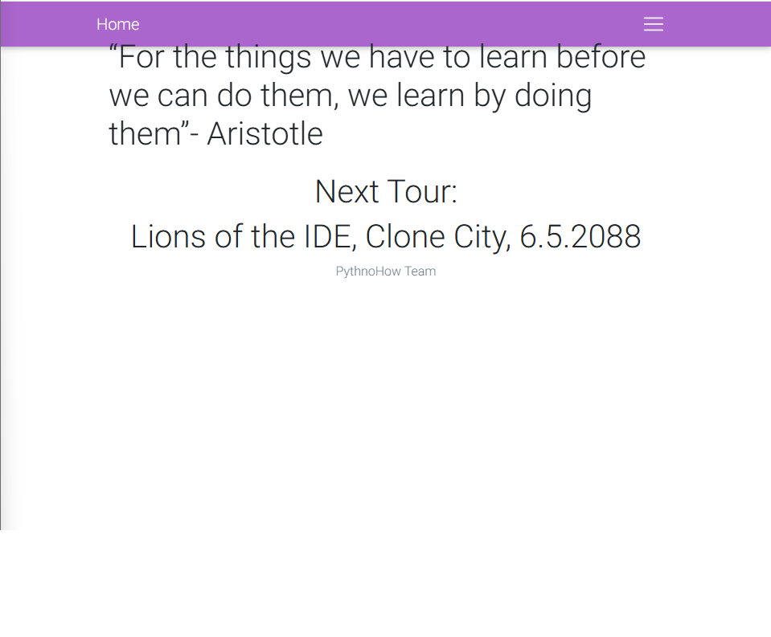
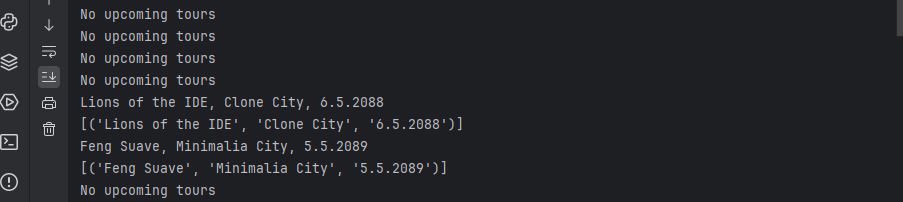
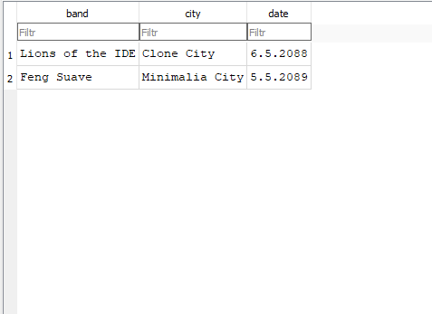
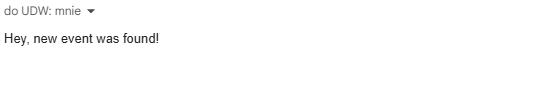

# 🎟️ Event Scraper and Email Notifier

A Python-based application that scrapes upcoming events from a website, stores new events in a SQLite database, and sends email notifications when new events are found.

## 🌍 Overview

This project automatically monitors a webpage for new event announcements. If a new event appears, it is saved in the local database, and a notification email is sent to the user.

## 🚀 Features

- Web scraping using Selectorlib
- Data extraction and storage in SQLite database
- Automated email alerts via SMTP
- Continuous monitoring with a 2-second interval

## 🛠️ Technologies Used

- Python
- Requests
- Selectorlib
- SQLite3
- smtplib

## 📦 Installation

1. Clone the repository:

   ```bash
   git clone https://github.com/DziwiszBB/event-scraper-email-notifier.git
   cd event-scraper-email-notifier
   ```

2. Install the required packages:

   ```bash
   pip install -r requirements.txt
   ```

3. Set up your email credentials inside `main.py`:

   ```python
   username = "your_email@gmail.com"
   password = "your_app_password"
   receiver = "your_email@gmail.com"
   ```

4. Run the application:

   ```bash
   python main.py
   ```

## 📄 Files

- `main.py` — Main scraper and email sender
- `example.py` — Examples of database operations
- `extract.yaml` — CSS selectors configuration
- `data.txt` — Sample events data
- `data1.db` — SQLite database file (generated automatically)

## 📁 Database Structure

| Column  | Type    | Description         |
|---------|---------|---------------------|
| Band    | TEXT    | Name of the band     |
| City    | TEXT    | City of the event    |
| Date    | TEXT    | Date of the event    |

## 📸 Screenshots

### 1. Web Page Scraping
View of the website showing an upcoming concert event extracted by the application.



### 2. Terminal Output
Terminal output showing detected new events and their storage.



### 3. Database Records
View of the SQLite database containing scraped event information.



### 4. Email Notification
Example of an automated email notification about a newly found event.



## 📄 License

This project is licensed under the MIT License – see the [LICENSE](LICENSE) file for details.

## 🙋‍♂️ Author

**Piotr Dziwisz**  
[LinkedIn](https://www.linkedin.com/in/piotr-dziwisz-8a20b7362/) | [GitHub](https://github.com/DziwiszBB)
